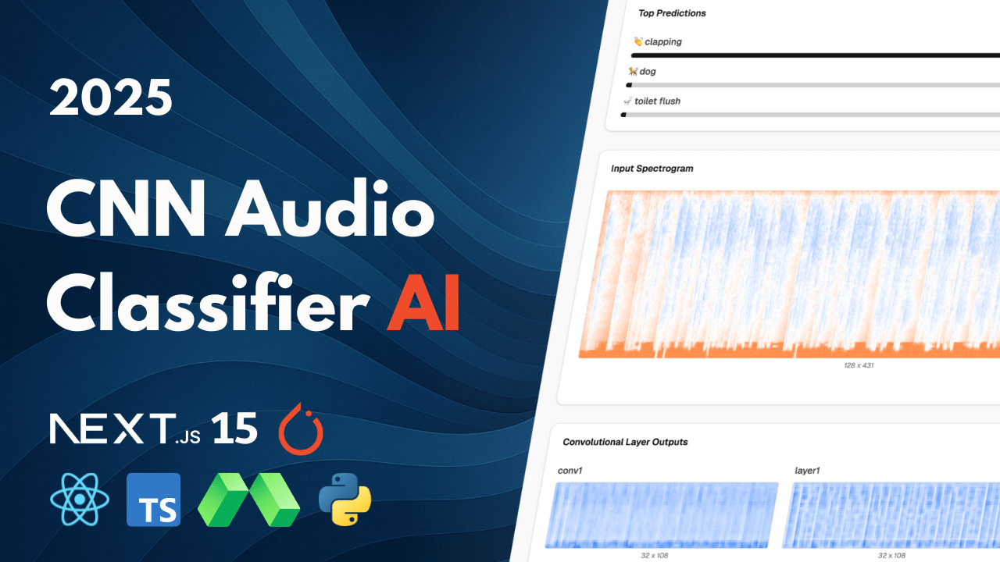

# Audio CNN



## Features:
- 🧠 Deep Audio CNN for sound classification
- 🧱 ResNet-style architecture with residual blocks
- 🎼 Mel Spectrogram audio-to-image conversion 
- 🎛️ Data augmentation with Mixup & Time/Frequency Masking
- ⚡ Serverless GPU inference with Modal
- 📊 Interactive Next.js & React dashboard
- 👁️ Visualization of internal CNN feature maps
- 📈 Real-time audio classification with confidence scores
- 🌊 Waveform and Spectrogram visualization
- 🚀 FastAPI inference endpoint
- ⚙️ Optimized training with AdamW & OneCycleLR scheduler
- 📈 TensorBoard integration for training analysis
- 🛡️ Batch Normalization for stable & fast training
- 🎨 Modern UI with Tailwind CSS & Shadcn UI
- ✅ Pydantic data validation for robust API requests

## Setup
 
Follow these steps to install and set up the project.

### Clone the Repository

```bash
git clone https://github.com/Andreaswt/audio-cnn.git
```

### Install Python

Download and install Python if not already installed. Use the link below for guidance on installation:
[Python Download](https://www.python.org/downloads/)

Create a virtual environment with **Python 3.12**.

### Backend

Navigate to folder:

```bash
cd audio-cnn
```

Install dependencies:

```bash
pip install -r requirements.txt
```

Modal setup:

```bash
modal setup
```

Run on Modal:

```bash
modal run main.py
```

Deploy backend:

```bash
modal deploy main.py
```

### Frontend

Install dependencies:

```bash
cd audio-cnn-visualisation
npm i
```

Run:

```bash
npm run dev
```
